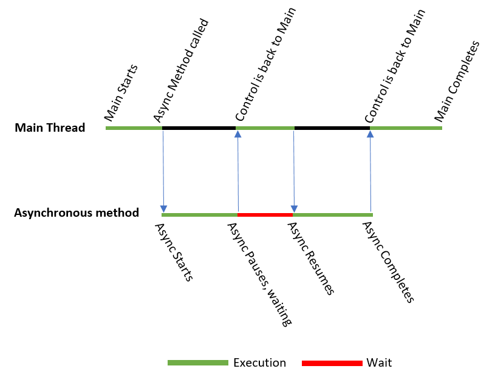

# Szinkron és Aszinkron kód

**Szinkron műveletek:**

A szinkron programozásban minden művelet egymás után, sorrendben történik.
Egy művelet befejezéséig a következő nem indul el. Ha valami hosszú ideig tart, például hálózati kérés vagy fájlírás, akkor a program "megáll", amíg az nem fejeződik be.

**Aszinkron műveletek:**

Az aszinkron programozás lényege, hogy egy műveletet elindítunk, de nem várjuk meg a befejezését, hanem folytatjuk a következő műveletet.
Az aszinkron kódok általában a felhasználói élmény javítását célozzák, mivel nem blokkolják az UI szálat, így a program folyamatosan reagálhat a felhasználói interakciókra (például gombnyomásra, ablakok frissítésére).

```cs
XAML:
<Window x:Class="Wpf_1_SnycAsync.MainWindow"
        xmlns="http://schemas.microsoft.com/winfx/2006/xaml/presentation"
        xmlns:x="http://schemas.microsoft.com/winfx/2006/xaml"
        xmlns:d="http://schemas.microsoft.com/expression/blend/2008"
        xmlns:mc="http://schemas.openxmlformats.org/markup-compatibility/2006"
        xmlns:local="clr-namespace:Wpf_1_SnycAsync"
        mc:Ignorable="d"
        Title="MainWindow" Height="450" Width="800">
    <Grid>
        <StackPanel>
            <Button x:Name="StartButton" Content="Start" Click="StartButton_Click" Width="100" Height="30" Margin="10"/>
            <TextBlock x:Name="ResultText" Text="Nyomd meg a gombot!" FontSize="16" VerticalAlignment="Center" HorizontalAlignment="Center"/>
        </StackPanel>
    </Grid>
</Window>
```


## Szinkron működés

A szinkron kódban egy darab fő szál (UI thread) van. Ha bekövetkezik egy esemény, akkor a fő szál teljes mértékben el lesz foglalva a StartButton_Click metódus végrehajtásával, és a WPF csak akkor kap lehetőséget a képernyő frissítésére, amikor a fő szál "szabad" lesz, vagyis az eseménykezelő befejeződik.

```cs
private void StartButton_Click(object sender, RoutedEventArgs e)
{
    StartButton.IsEnabled = false;
    MessageBox.Show("Gomb letiltva, most jön a Sleep"); // Ez megjelenik
    ResultText.Text = "Feldolgozás...";

    // Szinkron módon várakozunk 3 másodpercet
    Thread.Sleep(3000);

    ResultText.Text = "Kész! A művelet befejeződött.";
    StartButton.IsEnabled = true;
}
```


Tehát a végrehajtás a következőképpen alakul:
```console
[StartButton_Click esemény elindul]
          |
          v
[StartButton.IsEnabled = false] 
          |
          v
[MessageBox.Show("Gomb letiltva, most jön a Sleep");]
          |  (Modális ablak megjelenik, fő szál vár)
          v
[ResultText.Text = "Feldolgozás..."]
          |
          v
[Thread.Sleep(3000)] -----> [Fő szál blokkolva 3 másodpercig]
          |
          v
[ResultText.Text = "Kész! A művelet befejeződött."]
          |
          v
[StartButton.IsEnabled = true]
          |
          v
[Vége] -----> [UI most frissül, csak a "Kész!..." látható]
```

A `StartButton.IsEnabled = false` beállítása megtörténik a memóriában, és ez a változás jelzésre kerül a WPF-nek. Bár a gomb letiltása technikailag azonnal érvénybe lép (a gomb nem reagál kattintásra), a vizuális renderelés (pl. a gomb szürkén megjelenése) nem feltétlenül történik meg azonnal, mert a fő szál még nem adta át a vezérlést a renderelési ciklusnak.

A `MessageBox.Show("Gomb letiltva, most jön a Sleep");` meghívása egy modális ablakot hoz létre, amely saját belső üzenethurkot futtat a fő szálon. Ez lehetővé teszi, hogy az ablak megjelenjen, és a felhasználó interakcióba lépjen vele (pl. az "OK" gombra kattintson). A MessageBox megjelenése közben a WPF-nek lehetősége van feldolgozni az előzőleg beállított UI-változásokat (pl. a gomb letiltását), így a gomb szürkén jelenhet meg az ablak alatt. Ezért a MessageBox láthatóvá válik, mielőtt a kód továbbhaladna.

A `ResultText.Text = "Feldolgozás..."` beállítása megtörténik a memóriában, miután a MessageBox bezárul, de a képernyőn nem jelenik meg, mert a fő szál rögtön ezután a Thread.Sleep(3000) hívásba fut, ami blokkolja a további renderelést. A WPF nem jut el a renderelési fázisig, mert a fő szál "alszik".

A `Thread.Sleep(3000)` hívás 3 másodpercre blokkolja a fő szálat, vagyis a szál nem végez semmilyen más feladatot – beleértve a UI frissítését is –, így a "Feldolgozás..." szöveg nem látható a képernyőn.

Amikor a Thread.Sleep véget ér, a fő szál továbbfut, és végrehajtja a ResultText.Text = "Kész! A művelet befejeződött." utasítást. Ez a szöveg is beállítódik a memóriában (a ResultText objektum tulajdonsága frissül), de a képernyőn még mindig nem jelenik meg, mert a fő szál nem áll meg itt, hogy átadja a vezérlést a WPF renderelő rendszerének.

A szál rögtön továbbmegy a következő utasításra (StartButton.IsEnabled = true), majd befejezi a metódust, és visszaadja a vezérlést az úgynevezett üzenethuroknak (message loop).

Az üzenethurok az, ami figyeli az eseményeket (pl. kattintások, billentyűleütések), és elindítja a szükséges renderelési folyamatokat. Amíg a StartButton_Click fut, az üzenethurok "várakozik", mert a fő szál elfoglalt. Csak akkor lép működésbe, amikor a metódus véget ér, és a szál "szabad" lesz.

Ekkor a WPF végignézi az összes változást (pl. IsEnabled = false, "Feldolgozás...", "Kész!...", IsEnabled = true), és egyetlen frissítési ciklusban kirajzolja az aktuális állapotot – ami a te esetedben a "Kész! A művelet befejeződött." szöveg és az engedélyezett gomb.


## Aszinkron működés

Ahhoz, hogy a "Feldolgozás..." felirat megjelenjen, aszinkron módon kell megírni a kódot, hogy a fő szál ne blokkolódjon. Ehhez használhatjuk az async és await kulcsszavakat, valamint a Task.Delay-t a várakozáshoz. Íme a javított kód:

```cs
private async void StartButton_Click(object sender, RoutedEventArgs e)
{
    StartButton.IsEnabled = false;
    MessageBox.Show("Gomb letiltva, most jön a Sleep"); // Ez modálisan megjelenik
    ResultText.Text = "Feldolgozás...";

    // Aszinkron módon várakozunk 3 másodpercet
    await Task.Delay(3000);

    ResultText.Text = "Kész! A művelet befejeződött.";
    StartButton.IsEnabled = true;
}
```


A végrehajtás a következőképpen alakul:
```console
[StartButton_Click esemény elindul]
          |
          v
[StartButton.IsEnabled = false]
          |
          v
[MessageBox.Show("Gomb letiltva, most jön a Sleep");]
          |
          v
[ResultText.Text = "Feldolgozás..."]
          |  
          |  (UI frissül, a "Feldolgozás..." látható)
          v
[await Task.Delay(3000)] -----> [Fő szál szabad, UI reszponzív]
          |                      (3 másodperc várakozás aszinkron módon)
          v
[ResultText.Text = "Kész! A művelet befejeződött."]
          |
          v
[StartButton.IsEnabled = true]
          |
          v
[Vége]
```




Az aszinkron kód esetében a fő különbség az, hogy a fő szál nem blokkolódik, és a WPF-nek többször is lehetősége van a UI frissítésére a metódus futása közben.

Az aszinkron kódban a fő szál (UI thread) továbbra is egyetlen szálként működik, de az async és await használatával lehetővé tesszük, hogy a szál ne blokkolódjon hosszú műveletek (pl. várakozás) alatt. Nézzük meg, mi történik soronként:

`private async void StartButton_Click(object sender, RoutedEventArgs e)`:
A metódus async kulcsszóval van jelölve, ami azt jelzi, hogy aszinkron műveleteket tartalmazhat, és Task-okat visszaadhat (bár itt void, mert eseménykezelő).
A fő szál kezdi el a metódus végrehajtását, amikor a gombra kattintanak.

`StartButton.IsEnabled = false;`:
A gomb IsEnabled tulajdonsága false-ra állítódik a memóriában, ami azonnal jelzi a WPF-nek, hogy a gombot le kell tiltani.
A fő szál még nem adta át a vezérlést az üzenethuroknak, de a következő utasítások előtt a WPF-nek lehetősége lesz renderelni, ha szükséges.

`MessageBox.Show("Gomb letiltva, most jön a Sleep");`:
Ez egy modális ablakot hoz létre, amely blokkolja a kód további végrehajtását, amíg a felhasználó nem zárja be (pl. az "OK" gombra kattint).
A MessageBox saját belső üzenethurkot futtat a fő szálon, ami lehetővé teszi az ablak megjelenítését és az interakciót.
A StartButton.IsEnabled = false hatása ekkor renderelésre kerülhet, mert a MessageBox belső hurka feldolgozza a WPF üzenetsorát, így a gomb szürkén jelenhet meg az ablak alatt.
Amikor a felhasználó bezárja a MessageBox-ot, a fő szál folytatja a metódus végrehajtását.

`ResultText.Text = "Feldolgozás...";`:
A ResultText szövege a memóriában "Feldolgozás..."-ra állítódik.
Mivel ez a sor a MessageBox után fut, és még nem következik semmilyen blokkoló művelet, a fő szál hamarosan visszaadja a vezérlést az üzenethuroknak (a következő await miatt), így a WPF frissítheti a UI-t.
A "Feldolgozás..." szöveg láthatóvá válik a képernyőn, mert a renderelési ciklus futása nem akad meg.

`await Task.Delay(3000);`:
Ez a sor egy 3 másodperces aszinkron várakozást indít el. A Task.Delay egy Task objektumot hoz létre, amely a háttérben számolja az időt, és nem blokkolja a fő szálat.
Az await kulcsszó miatt a metódus itt "szünetel", és a vezérlés visszaadódik a hívó üzenethuroknak (a WPF eseménykezelő rendszerének).
A fő szál szabad marad, és az üzenethurok folytatja a munkát: feldolgozza az eseményeket (pl. egérmozgás, kattintások), és lehetővé teszi a WPF számára, hogy kirajzolja a "Feldolgozás..." szöveget.
A UI reszponzív marad a 3 másodperc alatt, tehát az alkalmazás nem "fagy le".
3 másodperc elteltével a Task.Delay befejeződik, és a fő szál folytatja a metódus végrehajtását a következő sorral.

`ResultText.Text = "Kész! A művelet befejeződött.";`:
A ResultText szövege a memóriában "Kész! A művelet befejeződött."-re frissül.
Mivel nincs további blokkolás, a fő szál hamarosan befejezi a metódust, és az üzenethurok újra lehetőséget kap a renderelésre.
A "Kész!..." szöveg megjelenik a képernyőn, mert a WPF feldolgozza ezt a változást a következő renderelési ciklusban.

`StartButton.IsEnabled = true;`:
A gomb IsEnabled tulajdonsága visszaáll true-ra a memóriában, így a gomb újra engedélyezve lesz.
Ez a változás is renderelésre kerül a metódus végén, amikor a WPF frissíti a UI-t.

A metódus vége:
A StartButton_Click befejeződik, és a fő szál visszaadja a vezérlést az üzenethuroknak.
A WPF egyetlen frissítési ciklusban kirajzolja az aktuális állapotot: a "Kész! A művelet befejeződött." szöveget és az engedélyezett gombot.


**Összegzés:**
Az `async` jelzi, hogy a metódus aszinkron műveleteket tartalmazhat, és lehetővé teszi, hogy a metódus "szüneteljen" anélkül, hogy blokkolná a fő szálat.
Az `await` megvárja a mögötte lévő Task befejezését, de közben a fő szál felszabadul, és visszaadja a vezérlést az üzenethuroknak. A Task maga nem feltétlenül fut külön szálon (pl. Task.Delay esetében nem), hanem egy aszinkron mechanizmust használ.
Amikor az await-elt Task befejeződik (pl. 3 másodperc múlva), a metódus folytatása visszaáll a fő szálra, és a kód továbbfut ott, ahol az await "szüneteltette".


